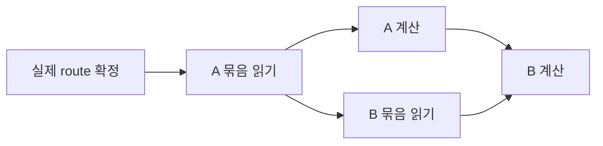

# 추가 성능 개선 조사 — 2026-09-12

현재 구현과 공개 소스·논문을 대조한 검토 기록이다. 아래 후보의 추가 개선율은
아직 실측하지 않았다. 기준 성능과 검증 조건은 [PREFILL_BATCHING.md](PREFILL_BATCHING.md)에 있다.

## 현재 조건과 남은 비용

- 2× GB10, TP2, 원본 MXFP4 expert/MXFP8 경로, DSpark5.
- 입력 묶음 2,048, 실제 expert 커널은 최대 512토큰. `execute`에서 나눠 호출하고 결과를 복사한다.
- target40층의 슬롯은 각각224개, draft3층은 각각128개다. expert 텐서는 rank당 약81.8 GiB.
- 6,313/12,270토큰 입력의 캐시 없는 pp는 144.59/171.46 tok/s다.
- 마지막 주기적 로그의 expert 읽기는 rank당 약201.8/309.0 GiB다. 정확한 요청 종료 카운터는 아니다.
- 긴 문맥 검증 후 호스트 가용 메모리는 약9.84/10.11 GiB였다.

따라서 아직 줄일 수 있는 대상은 반복 SSD 읽기, 읽기 대기, 작은 커널의 반복 호출과
버퍼 복사다. 최신 실행에 대한 동기화 프로파일은 추가로 필요하며, 과거 decode의
프로파일을 현재 pp의 시간 분해로 대입하지 않는다.

## 1. 버퍼 공유와 prefill 전용 실행 용량

**pp 우선 후보.** `b12x_slots.py:execution`은 scratch만 스트림별로 공유한다.
`x`, `ids`, `weights`, `out`은 여전히 층별·토큰 용량별로 보관한다. 동시에 쓰지 않는
층 사이에서 이 입출력 버퍼를 공유하면 큰 prefill 실행 계획에 필요한 공간을 확보할 수 있다.

소스의 크기로 계산하면 target40층에서 M=512 한 버킷의 네 버퍼는 합계 약0.587 GiB다.
한 벌을 공유할 수 있다면 약0.572 GiB의 중복을 줄이는 셈이다. M=2,048을 층별로
새로 할당하면 약2.347 GiB인데, 공유하면 이 중 약2.289 GiB의 중복을 피할 수 있다.
이 값은 **버퍼 모양으로 계산한 값**이며 실제 회수 메모리 측정이 아니다. draft,
다른 버킷, attention, allocator 예약 공간은 별도다.

현재 연결 코드의 512 제한을 벗어나 `ExecutionCapacity(max_tokens=1024/2048)`를
직접 시험할 수 있다. 라이브러리 계획 수립·scratch 요구량과 수치 검사를 먼저 통과해야 한다.
큰 커널 하나가 현재의 512 호출 여러 개보다 빠르다는 보장은 없다. 작은 decode 계획은
그대로 따로 유지한다. 그다음 scheduler를 3,072/4,096으로 늘리는 검사가 현실적이다.
8,192는 메모리 사용을 확인한 뒤의 후보이며 현재 메모리 보호 검사를 무조건 해제하지 않는다.

큰 실행 계획과 저장소를 분리하는 구조는 [b12x 실행 모델](https://github.com/local-inference-lab/b12x/blob/081b235931dbbcedcf0eb5899bae990c5dec5238/docs/moe-execution-model.md)과도 맞는다.
다만 문서의 AUTO A4/A16 경로는 ModelOpt NVFP4 대상이므로, 우리의 원본 E8M0
W4A8-MX 경로에 그대로 적용하지 않는다.

버퍼를 공유하려면 결과가 소비되기 전에 다음 graph가 덮어쓰지 않아야 한다.
target/draft와 다른 CUDA stream의 동시 실행도 분리해야 한다.
[PyTorch의 graph 메모리 설명](https://docs.pytorch.org/docs/2.14/notes/cuda.html#sharing-memory-across-captures)도
재생 순서·동시 실행·출력 수명에 조건을 둔다. 기존 교차 층/스트림 검사와 부분 타일,
긴 문맥→짧은 문맥 전환 검사를 확장하는 것이 필요하다.

## 2. 이미 결정된 expert의 읽기와 계산을 겹치기

**pp의 실행 구조 개선 후보.** 현재 `ensure`는 native batch 읽기를 제출한 뒤
`future.result()`로 기다리고, 그다음 해당 expert를 계산한다. 현재 overlap은 주로
shared expert와 읽기를 겹친다. 현재 routed expert 묶음을 계산하는 동안 다음 묶음의
읽기를 진행하는 구조는 아직 아니다.

두 버퍼 영역을 번갈아 쓰면 다음 순서를 만들 수 있다.

이 그림은 제안이며 구현/측정 결과가 아니다. 읽기 대상으로 실제 선택이 끝난 expert만
사용한다. 이전에 시험한 attention 전 예측기는 다른 설계다.

핵심은 버퍼 영역별로 이전 소비자가 끝났는지 확인하는 CUDA event와 슬롯 소유권이다.
현재 `read_stream`의 전체 stream 대기와 batch executor의 fence 계약을 그대로 둔 채
스레드만 추가하면 실제 중첩이 생기지 않을 수 있다. 읽는 영역과 계산하는 영역을 분리하고,
읽기 오류·취소·cache reset·graph 재생에서도 미완성 가중치가 노출되지 않아야 한다.
FP32 결과 합산 순서도 검증 대상이다. 버퍼를 위해 유효 캐시를 너무 줄이면 재읽기가
늘 수 있으므로 8/16/32개 등의 작은 묶음부터 비용을 측정한다.

[MoE-Prefill/AsyncEP](https://arxiv.org/abs/2605.02960v2)는 가중치 전송과 계산을
비동기로 겹치는 접근을 보여 준다. 다만 이 연구는 Qwen 기반 prefill-only 서비스와
GPU 사이 weight AllGather가 중심이다. 우리 SSD→GB10 경로에 그대로 쓸 백엔드는 아니며,
중첩 설계의 참고 근거다. 논문의 속도 배율을 우리 환경의 예상치로 사용하지 않는다.

## 3. 오늘 추가된 b12x V4.1 커널

**tg에서 특히 구체적인 후보.** 설치 버전 표시는1.3.0이지만 실제 고정 소스는
`789bbb3c846565c41f3404af3e0d7c9ce8702f7f`다. 2026-09-12의 이후 변경을 확인했다.

| 커밋 | 확인한 내용 | 현재 구성과의 관계 |
| --- | --- | --- |
| [081b2359](https://github.com/local-inference-lab/b12x/commit/081b235931dbbcedcf0eb5899bae990c5dec5238) | V4.1 WO와 MoE decode 수정. 원본 E8M0/A8의 전용 micro 경로는1~8토큰을 지원 | 현재 고정 버전의 일반 tiny 경로는1~4토큰이다. DSpark5의 draft5/verify6은 새 경로의 지원 범위에 들어간다 |
| [4af78b86](https://github.com/local-inference-lab/b12x/commit/4af78b86771d8491ec7b9d27168fdfbc1d67a773) | V4.1 attention 정밀도·계획 선택, indexer 정렬, mHC 용량 계획과 profile 갱신 | 우리 attention은 FlashInfer 경로이므로 패키지 교체만으로 이 커널이 사용되지는 않는다. 정밀도 조건도 별도로 대조해야 한다 |
| [6b133f58](https://github.com/local-inference-lab/b12x/commit/6b133f58884b80cdba7f326c711870ff4cecad68) | MXFP4 N64 tail 저장 처리 수정 | 우리 TP2 intermediate1152는128의 배수다. 이 tail 수정 자체의 직접 이득을 기대할 근거는 약하다 |

우리 hidden5120/intermediate1152/SiLU/E8M0 조건은 새 V4.1 micro 지원 조건에 맞는다.
이는 코드 수준의 적용 가능성 판단이며 실제 선택된 계획과 속도는 아직 검사하지 않았다.
WO 패킹 함수도 V4.1의 scale block을 인자로 받을 수 있게 바뀌었다.

다음 검증은 고정 새 커밋의 별도 이미지에서 실제 target/draft 기하와 M=1/5/6/8을
비교하는 것이다. cold/resident expert 상태를 나누고 원본 수치 계약을 확인한다.
현재 `.bin` 형식은 b12x의 준비된 내부 배열에 의존하므로 한 expert를 원본에서 준비해
기존 파일과 바이트·배열 배치를 비교해야 한다. ABI가 달라졌다면 별도 경로에 재패킹한다.
버전 문자열만 보고 현재 컨테이너에서 패키지를 바로 바꾸는 방식은 적절하지 않다.

## 4. 층 단위로 진행하는 Layered Prefill

**큰 구조 변경의 공개 선례가 있다.** [MLSys 2026 논문](https://proceedings.mlsys.org/paper_files/paper/2026/hash/c0f460c6d63599ea870ba9db63dc96a9-Abstract-Conference.html)과
[공개 코드](https://github.com/scale-snu/layered-prefill)를 확인했다. 토큰 묶음마다
모든 층을 순회하는 대신, 층 그룹을 기준으로 prefill을 진행해 반복 expert 접근을 줄인다.
코드는 큰 prefill 묶음과 층 그룹 스케줄링을 사용한다.

논문은 H100/A100과 다른 MoE 모델에서 검증했고, 공개 설치 예시는 Torch2.8과
CUDA arch8.0/9.0을 대상으로 한다. 현재 V4.1/GB10/Torch2.13에 맞춘 이식이 필요하다.
논문의 최대70% TTFT 감소는 우리 SSD TP2의 보장값이 아니다.

우리 경우에는 먼저 더 큰 전체 prefill을 메모리 안에 넣는 방법을 시험하고, 한계에
부딪히면 층별 실행 중단·재개를 검토하는 순서가 타당하다. 완전한 이식은 mHC residual,
층별 KV 진행 상태, prefix cache의 완성 시점, Engram lookback, DSpark와 TP 동기화를
다뤄야 한다. 정답을 유지하는 실행 스케줄 변경을 목표로 하며 재학습은 전제가 아니다.

## 다른 공개 수치와 제외한 접근

- [tonyd2wild의 최신 구성](https://github.com/tonyd2wild/DeepSeek-V4.1-Flash-vLLM-DGX-Spark)은
  TP4 EXL3를 기본으로 바꾸고 TP3 EXL3도 추가했다. [AidenLab의 최신 기록](https://aidenle.com/recipes/deepseek-v4-1-flash-4x-dgx-spark/)도4대 구성이다.
  그 환경의 pp1~2천을 우리2대의 예상 속도로 대입할 수 없다. 우리 형식의 모든
  packed expert만 해도 TP2 rank당 약137.83 GiB로, dense/KV를 넣기 전부터 호스트 물리
  메모리 약121 GiB보다 크다. 병렬 방식 이름만 바꿔 전체 상주 조건을 만들 수는 없다.
- 최신 [DeepGEMM 본가](https://github.com/deepseek-ai/DeepGEMM)는 일반 요구 사항을
  SM90/SM100으로 명시한다. SM12x의 일부 지원 경로는 별도로 구분해야 하며,
  [SM121 varlen/long-context 문제 보고](https://github.com/deepseek-ai/DeepGEMM/issues/425)도 있다.
  현재 일부 연산은 이미 vendored DeepGEMM을 쓴다. 전체 교체를 단일 해결책으로 보지 않는다.
- 기존 예측 prefetch는 반복 decode를 약6~7% 늦췄고 전체 model graph도 이전 TP2
  측정에서 불리했다. 그 옵션을 그대로 다시 켜는 것은 우선 후보가 아니다.
  새 micro 커널이나 위의 확정 route 중첩은 별도 구현이므로 이전 결과만으로 배제하지 않는다.

## 다음 실험 순서

1. pp 목표: 버퍼 수명/중복 할당 계측 → 버퍼 공유 → native1,024/2,048 실행 계획 → scheduler3,072/4,096.
2. tg 목표: 새 b12x 커밋의 원본 E8M0 micro5/6 경로와 WO를 각각 분리해 검증.
3. pp 목표: 실제 route 기반 두 버퍼 I/O 중첩. 먼저 현재 pp의 I/O·GPU·CPU 시간을 계측한다.
4. 더 큰 변경: V4.1에 맞춘 Layered Prefill 실행기.

각 단계에서 같은 입력·캐시 조건으로 두 노드의 pp/tg/ttft, 읽기 바이트, 메모리 peak,
답변 정확성을 비교한다. 현재 이미 통과한 SparkTalk 도구 포함 요청, 연속 대화,
54,988토큰 입력과8,192토큰 출력 허용량도 유지해서 검증한다.
